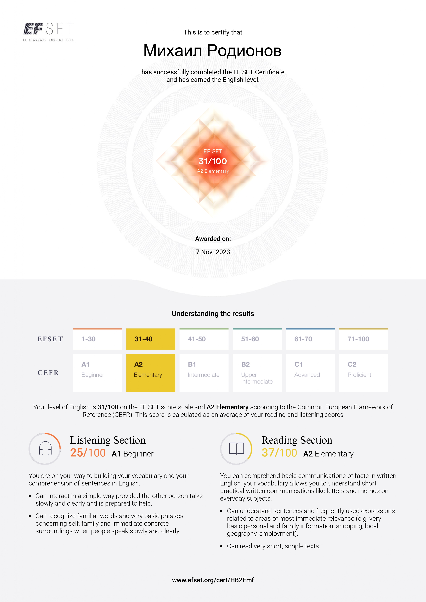

# CV
---
## Rodionov Michail
 * [Telegram](https://t.me/mi6aRdnv) 
 * [Github](https://github.com/Mi6aRdnv) 
 * [Codewars](https://www.codewars.com/users/Mi6aRdnv)

I'm studying Software Engineering at the university. Had experience working in IT as a PPC marketer for a little over a year. Gained skills in teamwork, working remotely, and became familiar with project management programs.

My skill:
1. HTML/CSS
2. Javascript
3. Figma(_and other graphic editors_)
4. Git/Github

#### Code Examples
```
function nthFibo(n) {
  if(n <= 1){return 0}
  if(n <= 3){return 1}
  let x = 1, y = 1, box;
  
  for(let i = 3; i != n; i++){
    box = x
    x += y
    y = box
    
  }
  return x
}
```

My English is at A2 level, but I study it intensively
